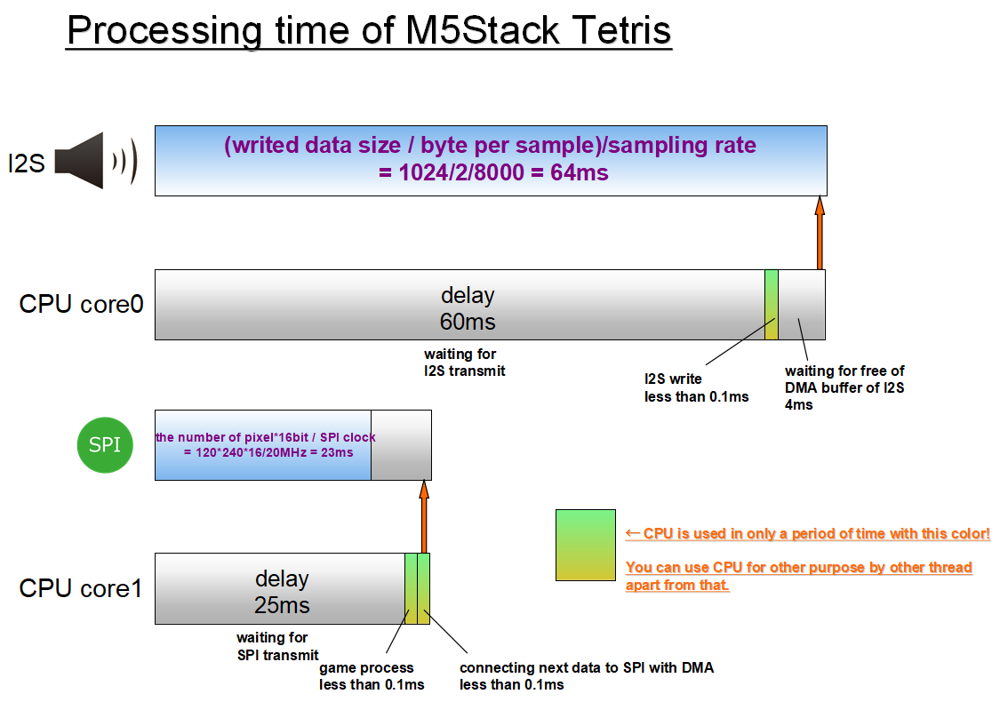

# M5Stack_Tetris
Add BGM to Example Tetris https://github.com/m5stack/M5Stack/tree/master/examples/Games/Tetris.
This uses interrupt transactions with DMA for SPI to display LCD. Use library https://github.com/MhageGH/M5Stack_LCD_DMA.
   